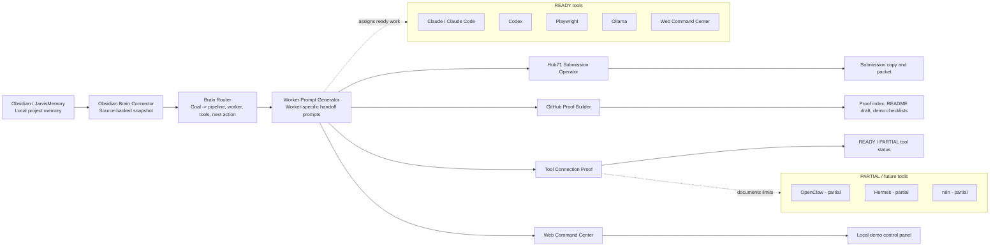

# SHAURYA Automation OS Architecture

## Summary
SHAURYA Automation OS is a working internal operator system. It reads trusted local context, routes a goal to the right workflow, generates worker prompts, checks tool readiness, and produces proof reports.

## Current Proof Boundary
- Working today: Brain Router, Worker Prompt Generator, Tool Connection Proof, Hub71 Submission Operator, GitHub Proof Builder, Web Command Center.
- Ready tools: Claude / Claude Code, Codex, Ollama, Playwright, Obsidian/JarvisMemory, Web Command Center.
- Partial/future tools: OpenClaw, Hermes, n8n.
- RUDRA is early project proof only, not the main company.
- No revenue, customers, public SaaS launch, GitHub push, or Hub71 acceptance is claimed.
