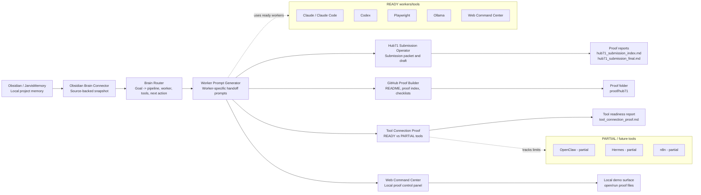

# Hub71 Architecture Diagram

_Current state: working internal system, being productized next._

## Plain-English Architecture
- Obsidian / JarvisMemory is the local memory source.
- The Obsidian Brain Connector converts memory into a source-backed snapshot.
- Brain Router chooses the right pipeline, worker, tools, and next action for the goal.
- Worker Prompt Generator creates the handoff prompt.
- Operators turn that handoff into concrete artifacts: Hub71 submission copy, GitHub proof files, tool readiness reports, and demo checklists.
- Web Command Center is the local control panel for opening and running proof workflows.

## Tool Readiness
- READY: Claude / Claude Code, Codex, Ollama, Playwright, Obsidian/JarvisMemory, Web Command Center.
- PARTIAL: OpenClaw, Hermes, n8n.
- RUDRA: early project proof only, not the main company.

## Claim Boundary
This architecture represents a working internal system. It does not claim revenue, customers, public SaaS launch, external integrations, or fully automated partial tools.
